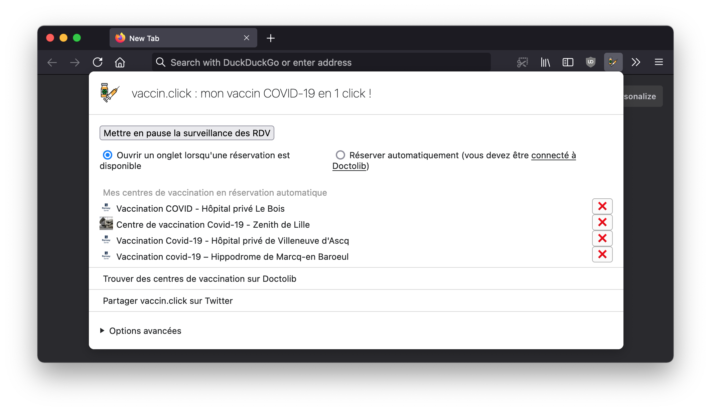
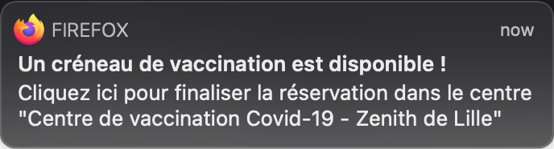

## Trouvez et réservez automatiquement votre créneau de vaccination COVID-19

**_vaccin.click_ supporte désormais la 3ème dose !**

La vaccination contre le COVID-19 est nécessaire pour obtenir un pass sanitaire, mais si vous n'êtes pas prioritaire, il est très difficile de trouver un créneau disponible. Si vous en avez marre [d'actualiser frénétiquement Doctolib](https://twitter.com/marine_roussill/status/1393185768219287552) pour trouver un RDV, cette extension pour [Firefox](https://www.mozilla.org/fr/firefox/new/) est faite pour vous !

_vaccin.click_ vous permet de lister les centres de vaccination dans lesquels vous pouvez vous rendre et de réserver automatiquement dès qu'un créneau est disponible (avant le lendemain soir ou dès le 31 mai) !

### Installer vaccin.click

1. Si ce n'est pas encore fait, [installez Firefox sur votre ordinateur](https://www.mozilla.org/fr/firefox/new/), un navigateur web libre, gratuit et respectueux de votre vie privée (la version mobile de Firefox n'est pas supportée)
2. [Installez l'extension _vaccin.click_](https://addons.mozilla.org/fr/firefox/addon/vaccin-click/)

**Vous êtes prêt⋅e à être vacciné !**

### Comment ça marche ?

1. Cliquez sur l'icône représentant un vaccin qui est apparue dans la barre d'outils
2. Choisissez si vous voulez que la page du centre de vaccination s'ouvre quand un créneau est disponible (par défaut), ou si vous souhaitez que _vaccin.click_ essaie de prendre le rendez-vous pour vous automatiquement (pour utiliser cette fonctionnalité, il faut que vous soyez connecté⋅e à Doctolib, dans ce cas l'extension choisira automatiquement le premier RDV disponible pour la 1ère et la 2nde dose - soyez sûr⋅e de pouvoir vous y rendre !)
3. Cliquez sur `Trouver des centres de vaccination sur Doctolib`
4. Doctolib s'ouvre, utilisez les filtres pour trouver les centres de vaccination près de chez vous
5. Ajoutez des centres à votre liste à surveiller en appuyant sur le bouton `Ajouter à ma liste` ajouté par l'extension

L'extension va alors automatiquement vérifier les disponibilités de chaque centre toutes les 3 minutes.
Dès qu'une disponibilité est trouvée, une notification est affichée et l'onglet du centre de vaccination s'ouvre pour vous permettre de finaliser la prise de rendez-vous.

Si vous avez activé le mode automatique, une notification s'affiche et un onglet s'ouvre pour vous prévenir que le rendez-vous a été pris. Vous recevrez également un mail de Doctolib. Si un problème survient au moment de la réservation automatique, la page s'ouvre pour que vous puissiez finaliser à la main (fonctionnement similaire au mode non-automatique).

**Attention : la vérification périodique ne fonctionne que quand votre navigateur et votre ordinateur sont ouverts !**

A tout moment, arrêtez la surveillance en cliquant sur `Mettre en pause la surveillance des RDV`.

Quand un RDV est réservé, l'extension arrête automatiquement la surveillance. Si vous avez trouvé un rendez-vous sans utiliser l'extension, pensez à l'arrêter !

De même, si vous avez un empêchement, n'oubliez pas d'annuler le RDV depuis l'interface de Doctolib.

## Foire Aux Questions

### Quel vaccin est choisi ?

L'extension choisit un vaccin Pfizer ou Moderna (en fonction des disponibilités), seuls éligibles pour la population générale.

### Est-ce que les autres sites que Doctolib sont supportés ?

Pas pour l'instant. Si vous êtes un développeur, [vous pouvez contribuer pour ajouter le support d'autres sites](https://github.com/dunglas/vaccin.click).

### Est-ce que les autres navigateurs web sont supportés ?

Pas pour l'instant (même si l'extension devrait fonctionner aussi avec Safari). Si vous êtes un développeur, [vous pouvez contribuer pour ajouter le support d'autres navigateurs](https://github.com/dunglas/vaccin.click).

### Est-ce que les versions mobiles de Firefox sont supportées ?

Pas pour l'instant, les versions Android et iOS de Firefox ne sont pas compatibles avec les extensions conçues pour la version pour ordinateur. Si vous êtes un développeur, [vous pouvez contribuer pour ajouter le support de ces plateformes](https://github.com/dunglas/vaccin.click).

### Combien ça coûte ?

L'extension est entièrement gratuite. C'est [un logiciel libre](https://fr.wikipedia.org/wiki/Logiciel_libre) sous licence AGPL dont vous pouvez [trouver le code source sur GitHub](https://github.com/dunglas/vaccin.click).

Si le projet vous plaît, n'hésitez pas à [faire un don à l'hôpital public](https://www.chu-lille.fr/soutenez-le-chu-de-lille) pour assurer un service de santé de qualité à toutes et tous (et peut-être qu'un jour il ne sera plus nécessaire de confier nos données de santé à des entités privées pour se faire vacciner...).

Si vous souhaitez m'accorder du temps pour corriger les bugs et ajouter de nouvelles fonctionnalités (support d'autres sites, d'autres navigateurs...), vous pouvez me [sponsoriser sur GitHub](https://github.com/sponsors/dunglas).

### Mes données sont-elles collectées par l'extension ?

Non (mais elles le sont par Doctolib et le centre de vaccination bien entendu). L'extension fonctionne entièrement en local sur votre propre ordinateur.

### Chez moi ça marche pas !

Cette extension est un projet non-commercial et est fournie sans aucune garantie. Le code de Doctolib peut changer, et certains centres de vaccination ont des formulaires particuliers qui ne sont pas encore supportés par l'extension.

Pour vérifier si l'extension fonctionne correctement vous pouvez taper `about:devtools-toolbox?id=extension%40vaccin.click&type=extension` dans la barre d'URL.

Si elle fonctionne, un message indiquant "aucun créneau disponible" doit être loggué régulièrement (il faut déplier la clef `error` pour le voir).
Si vous ne voyez pas ce message, n'hésitez pas à [ouvrir un ticket](https://github.com/dunglas/vaccin.click/issues) en indiquant quel est le problème rencontré, quel est le message d'erreur précis et quelle est l'URL du centre de vaccination pour lequel l'extension ne fonctionne pas.

### Qui a créé cette extension ?

Cette extension a été créée par [Kévin Dunglas](https://dunglas.fr) ([Twitter](https://twitter.com/dunglas)) et Anne Lesouef.

Les [icônes](https://www.iconfinder.com/icons/5959975/corona_drugs_injection_syringe_vaccine_icon) ont été réalisées par [E Conceptive](https://www.iconfinder.com/econceptive) (licence Creative Commons Attribution 3.0 Unported).

Le thème du site web a été réalisé par [orderedlist](https://orderedlist.com).
